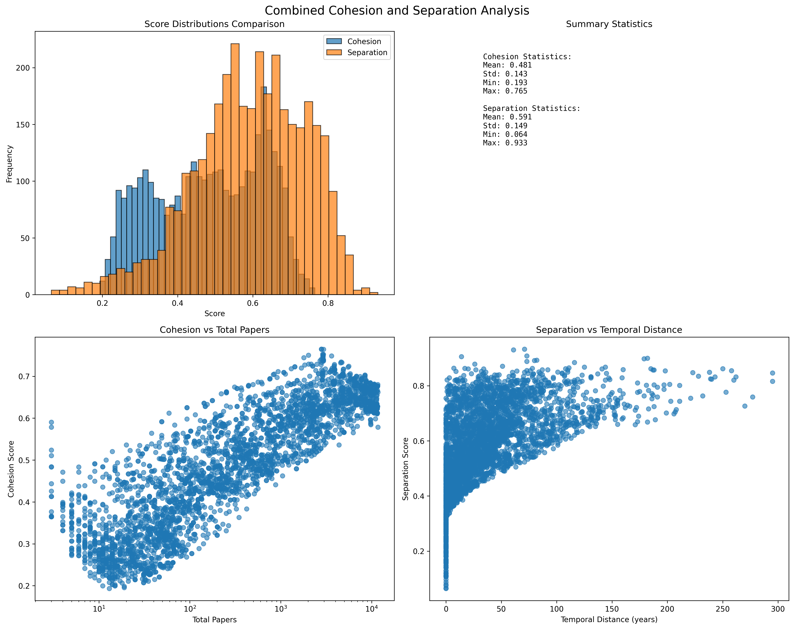

# Segment Score Distribution Analysis

## Experimental Settings

### Methodology
- **Cohesion Scoring**: 1-JSD between individual years and overall segment keyword distributions
- **Separation Scoring**: JSD between segment pairs' keyword distributions
- **Stratified Sampling**: Segments sampled across size, temporal position, and domain dimensions

### Sample Size
- **Total Samples**: 7,000 (3,500 cohesion + 3,500 separation)
- **Per Domain**: 500 cohesion samples + 500 separation pairs
- **Domains**: 7 academic domains (applied_mathematics, art, computer_vision, deep_learning, machine_learning, machine_translation, natural_language_processing)

## Results

### Cohesion Scores
- **Mean**: 0.481 ± 0.143
- **Range**: [0.193, 0.765]
- **Quartiles**: [0.354, 0.489, 0.614]

#### By Domain:
- **natural_language_processing**: 0.536 ± 0.144 (highest)
- **machine_translation**: 0.497 ± 0.110 (most consistent)
- **applied_mathematics**: 0.496 ± 0.135
- **computer_vision**: 0.504 ± 0.149
- **art**: 0.453 ± 0.112
- **machine_learning**: 0.444 ± 0.156
- **deep_learning**: 0.437 ± 0.161 (lowest, most variable)

#### By Segment Size:
- **3-5 years**: 0.554 average (high coherence)
- **6-9 years**: 0.493 average (moderate coherence)
- **10-12 years**: 0.474 average (baseline coherence)
- **13+ years**: 0.278 average (low coherence)

#### By Temporal Position:
- **Late periods**: 0.541 ± 0.112 (n=2534)
- **Middle periods**: 0.325 ± 0.083 (n=913)
- **Early periods**: 0.284 ± 0.049 (n=53)

### Separation Scores
- **Mean**: 0.591 ± 0.149
- **Range**: [0.064, 0.933]
- **Quartiles**: [0.499, 0.603, 0.705]

#### By Domain:
- **deep_learning**: 0.659 ± 0.163 (highest, most variable)
- **machine_learning**: 0.655 ± 0.157
- **art**: 0.611 ± 0.114
- **applied_mathematics**: 0.581 ± 0.134
- **computer_vision**: 0.568 ± 0.141
- **natural_language_processing**: 0.535 ± 0.149
- **machine_translation**: 0.527 ± 0.118 (lowest, most consistent)

#### By Temporal Distance:
- **0-10 years apart**: 0.523 ± 0.128 (n=554)
- **11-50 years apart**: 0.603 ± 0.108 (n=1578)
- **51-100 years apart**: 0.684 ± 0.091 (n=723)
- **100+ years apart**: 0.735 ± 0.070 (n=271)

#### By Overlap:
- **Overlapping segments**: 0.355 ± 0.141 (n=374)
- **Non-overlapping segments**: 0.619 ± 0.122 (n=3126)

### Correlations
- **Cohesion vs Papers per year**: +0.717 (strong positive)
- **Cohesion vs Segment size**: -0.303 (moderate negative)
- **Separation vs Temporal distance**: +0.551 (strong positive)
- **Separation vs Temporal overlap**: -0.471 (strong negative)

## Key Findings

### Size-Coherence Tradeoff
Smaller segments (3-5 years) achieve significantly higher cohesion (0.554) but may miss broader themes. Larger segments (10+ years) have lower cohesion (0.474) but capture comprehensive evolution.

### Temporal Effects
- **Recent periods** show highest cohesion (0.541), suggesting increasing specialization
- **Temporal distance** has strong linear relationship with separation (0.523 → 0.735)
- **Overlapping segments** show 0.264 reduction in separation scores

### Domain Characteristics
- **Natural Language Processing**: Highest cohesion (0.536), moderate separation (0.535) - consistent, evolving field
- **Deep Learning**: Lowest cohesion (0.437), highest separation (0.659) - diverse subfields with clear transitions
- **Machine Translation**: Most consistent scores - steady, focused evolution

### Benchmarks
- **Cohesion baseline**: 0.481 ± 0.143 for random segments
- **Separation baseline**: 0.591 ± 0.149 for random pairs
- **Overlap penalty**: 0.264 reduction in separation
- **Size penalty**: 0.276 reduction in cohesion for large segments 